# Craft Setup

To start the project we want to setup craft. Here we will create a
new page section and a global set which holds our navigation.

## Open Craft

To open craft you gan either go to `localhost:8080` and click on a link there.

Or go into your project folder and the craft folder and execute:
```bash
ddev launch admin
```

You will now be asked to login.

## Pages

Lets now create our first section, got to `Settings > Sections` and click on `New Section`.

As a name we will use `Pages`.
Set the Section Type to `Structure` (this allows the pages to be reordered and nested).
Set the `Entry URI Format` to `{parent.uri}/{slug}`.

The section should now look like this:
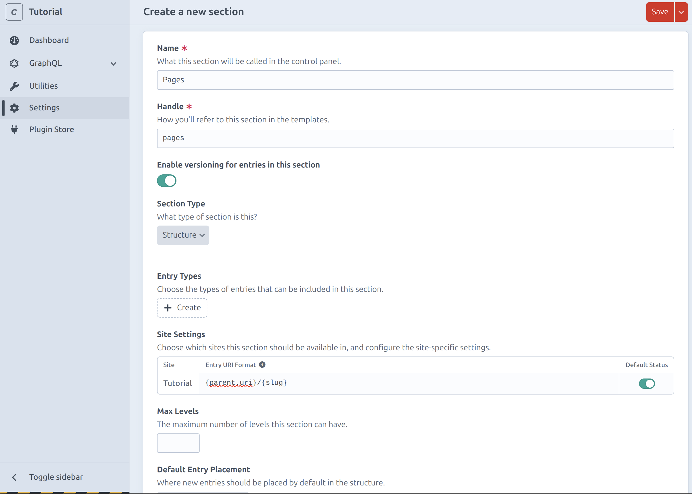

### Page
To define what fields a page can have we need to create a new entry type.

Click `Create` in the `Entry Types` section and name it `Page` then click `Save`.

### Homepage
For the homepage we will create another entry type, because we want it to have a different layout.

Click `Create` in the `Entry Types` section and name it `Home` then click `Save`.


The section should now have two entry types:
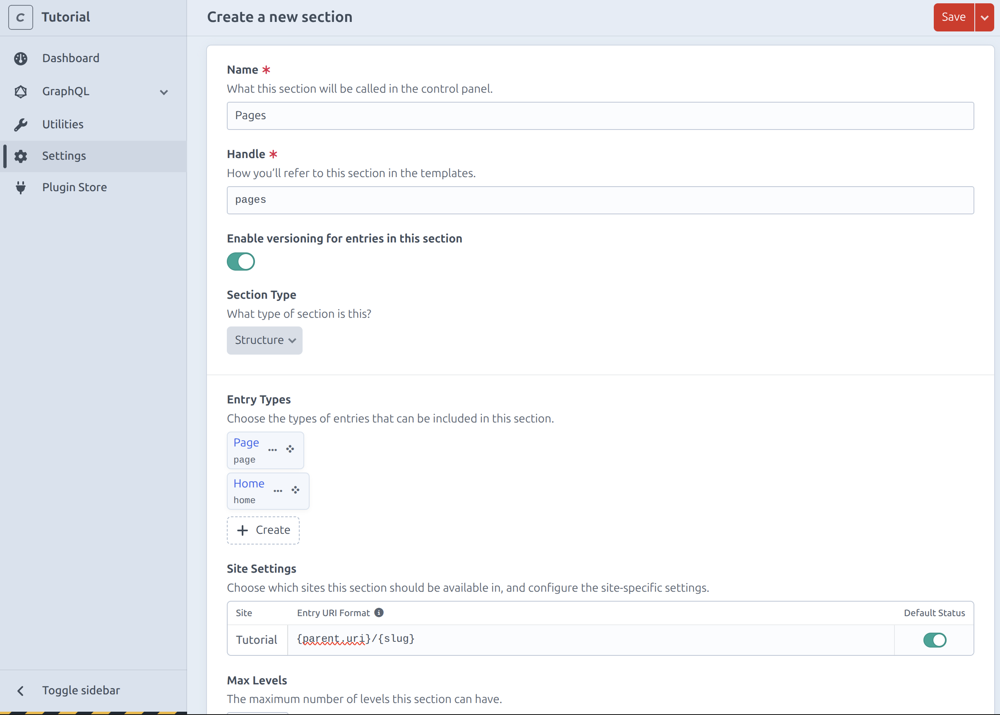

Now save the section.

### Create page

To checkout what we just did, go to `Entries > Pages`.
Now to create the Homepage click on `New Entry`.
Set the title to `Home` and select the `Home` entry type.

Then to make sure the homepage is the first page set the slug to `__home__`.
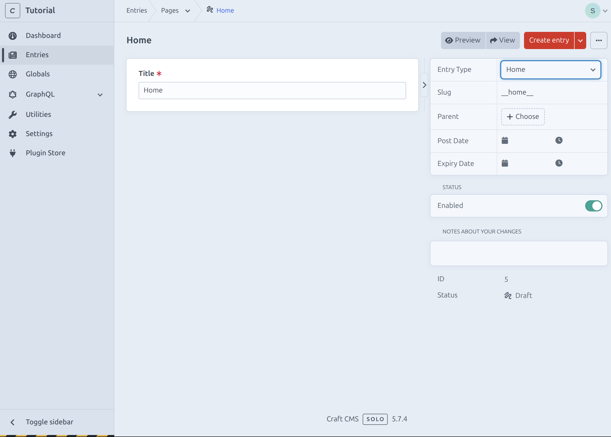

Create another Page named `News`.
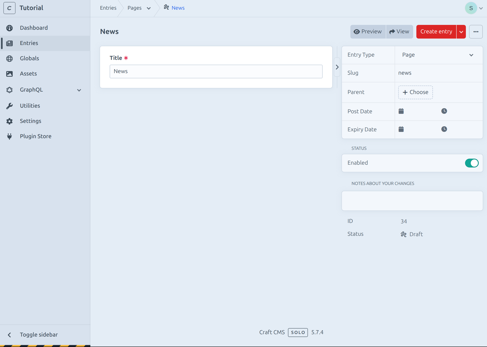

## Header

To allow our users to create a navigation we need to create a new global set.

Go to `Settings > Globals` and click on `New global set`.

As a name we will use `Header` then click on `New Tab` and confirm.

Now we will create our first field.

Because we want the user to be able to insert multiple navigation items we will use a matrix field.

### Navigation

Click on `Add` and then `new field`.
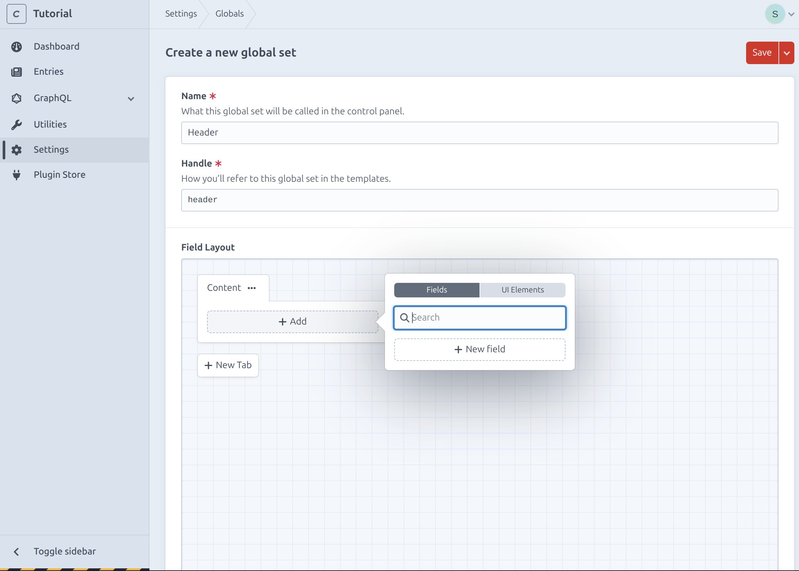

Set the name to `Navigation` and the Field Type to `Matrix`.
Change the View Mode to `As inline-editable blocks`.
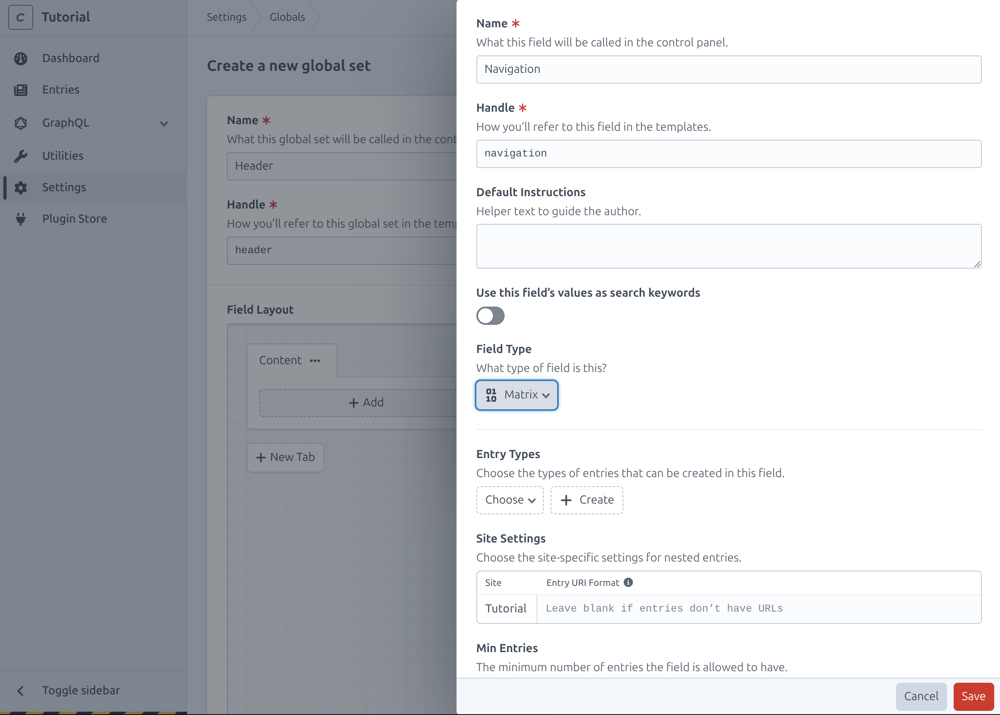

Click `Create` to add a new entry type for the navigation item.
Here you can define all fields which should be repeatable.

Set the name to `Navigation Item`.
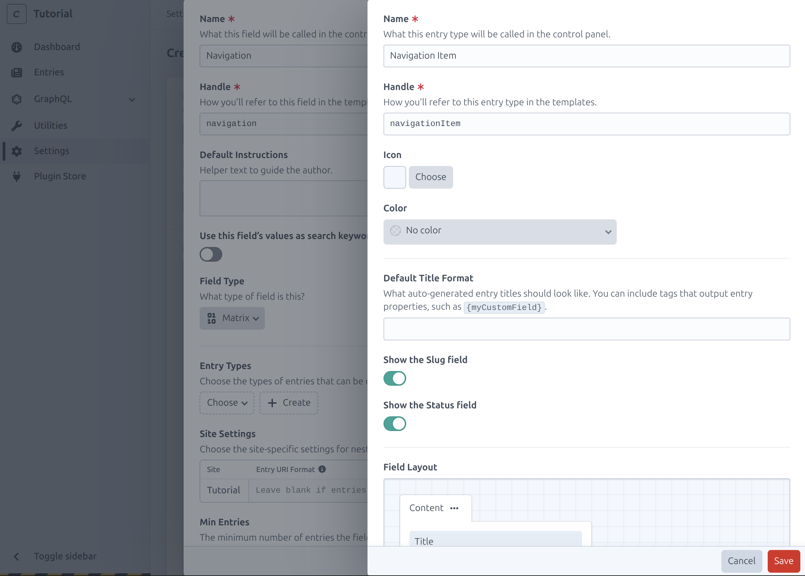

Now in that Entry type add a new field called `Nav Link`.
Select the field type `Link`.
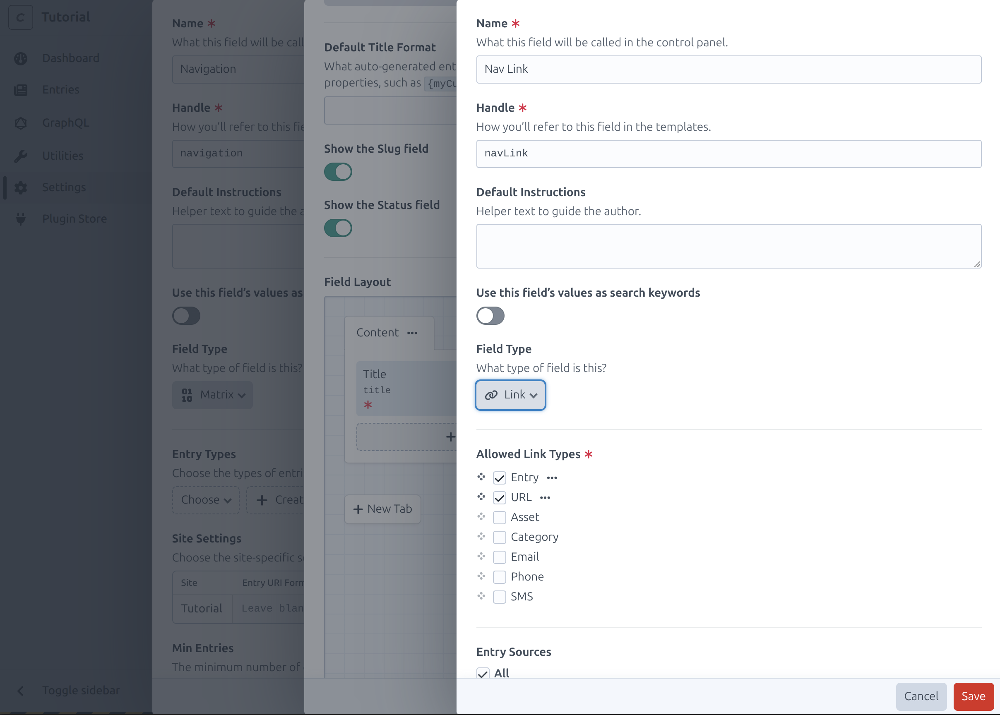

And enable `Show the "Label" field` and `Target`.
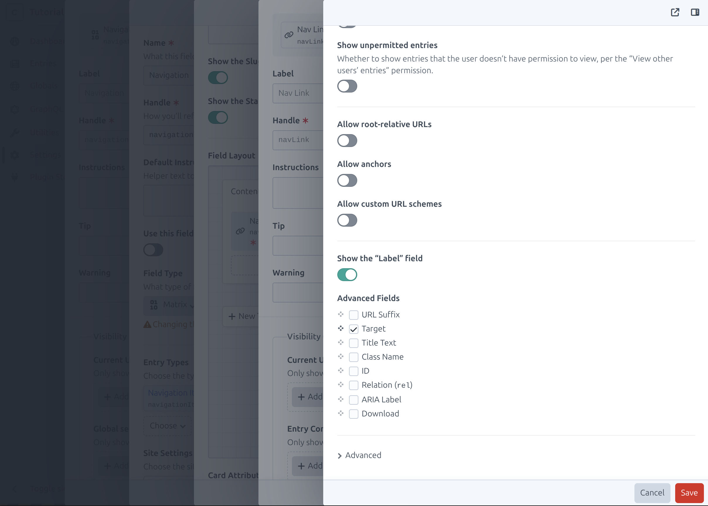

After clicking `Create` click on the three dots and select `Make required`.
Then remove the `Title` field either via drag and drop or the three dots.
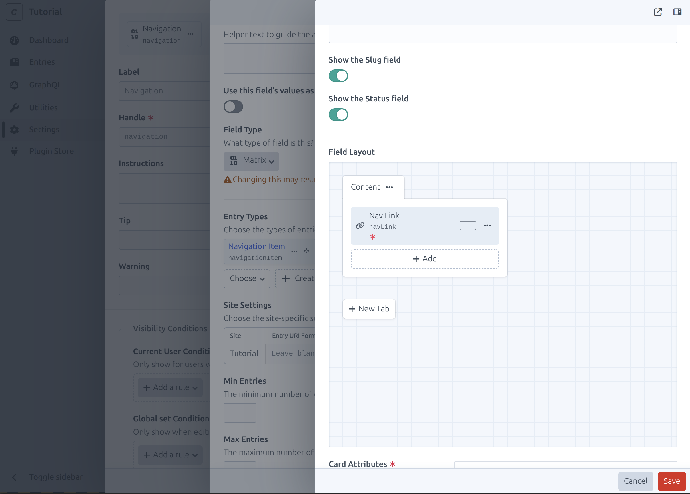

Now save the `navItem`, `navigation` and `header`.

To Checkout what we just did go to `Globals`.

Add both pages we created before to the navigation.
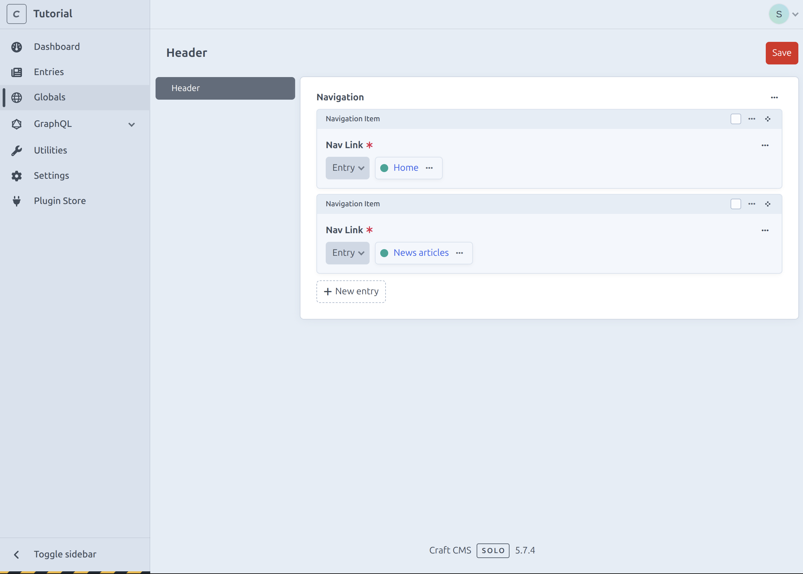

## GraphQl

To finish the craft part, we need to allow queries to be made for the newly
created section and global.

Go to `GraphQL > Schemas > Endpoint Schema` and select all `Entries` and `Global Sets`.
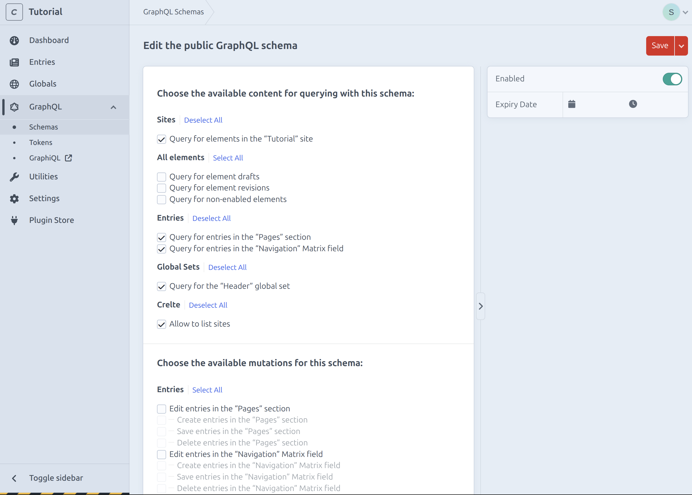
