# Craft Setup

To start the project we want to setup Craft CMS. Here we will create a
new section and a global set which holds our navigation.

## Open Craft

To open Craft CMS you gan either go to `localhost:8080` and click on any of the craft links there.

Or go into your project folder, access the `/craft` folder and execute:

```bash
ddev launch admin
```

You will now be asked to login using the credentials you defined during the project setup.

## Pages

Let's create our first section. Go to `Settings` → `Sections` and click on `New Section`.

As a name we will use `Pages`.
Set the Section Type to `Structure` (this allows the pages to be reordered and nested within the CMS).
Set the `Entry URI Format` to `{parent.uri}/{slug}`.

The section should now look like this:

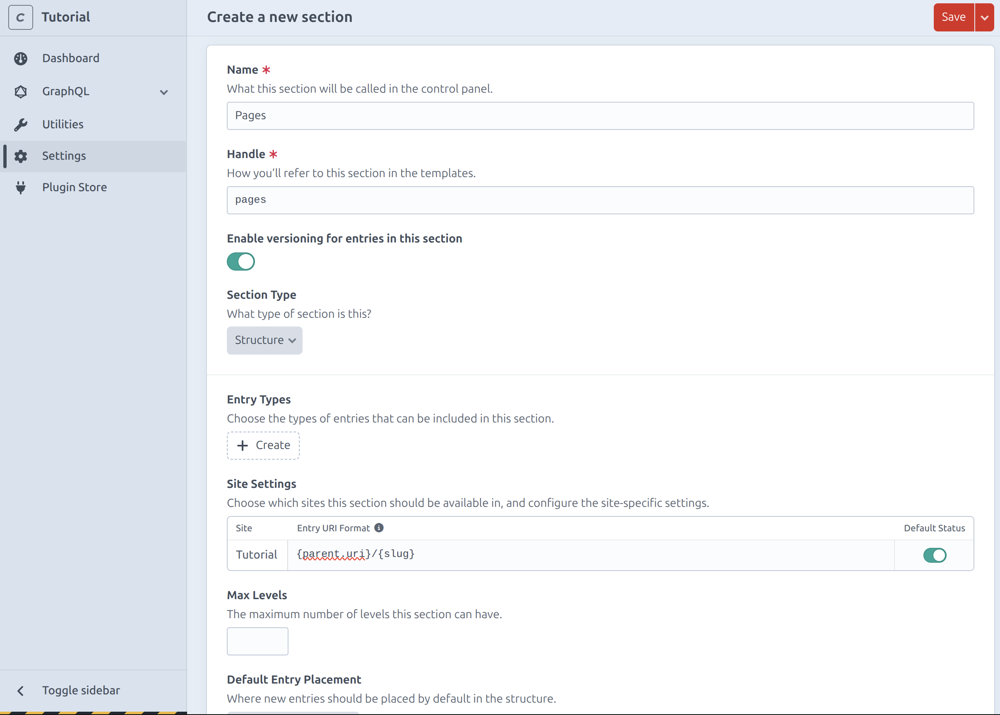

### Page

To define what fields a page can have we need to create a new entry type.

Click `Create` in the `Entry Types` section and name it `Page`. Then click `Save`.

### Homepage

For the home page we will create another entry type, because we want it to have a different layout.

Click `Create` in the `Entry Types` section and name it `Home`. Then click `Save`.

The section should now have two entry types:

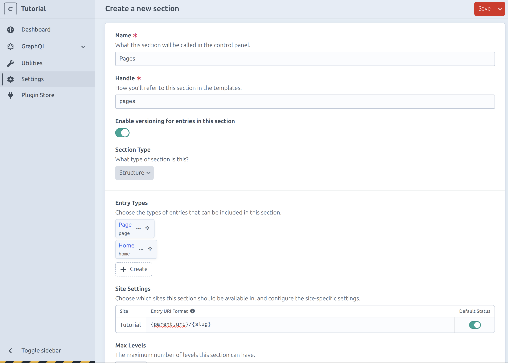

Now save the section by clicking `Save` in the top right corner.

### Create page

To check what we just did, go to `Entries` → `Pages`.
To create the home page, click on `New Entry` in the top right corner of the window.
Set the title to `Home` and select the `Home` entry type.

To make sure the home page is the actual first page, set the slug to `__home__`.

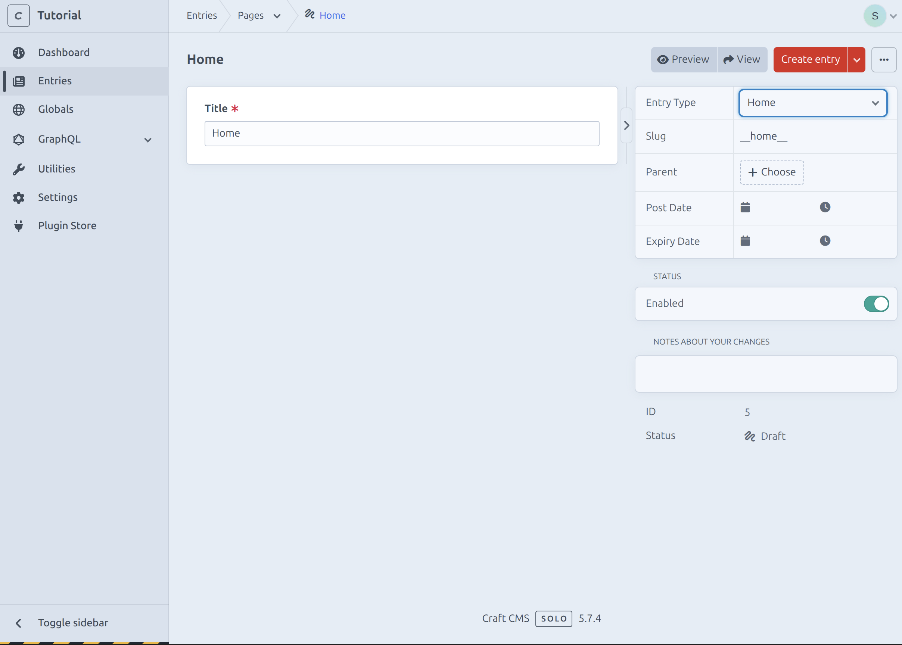

Create another Page named `News`.

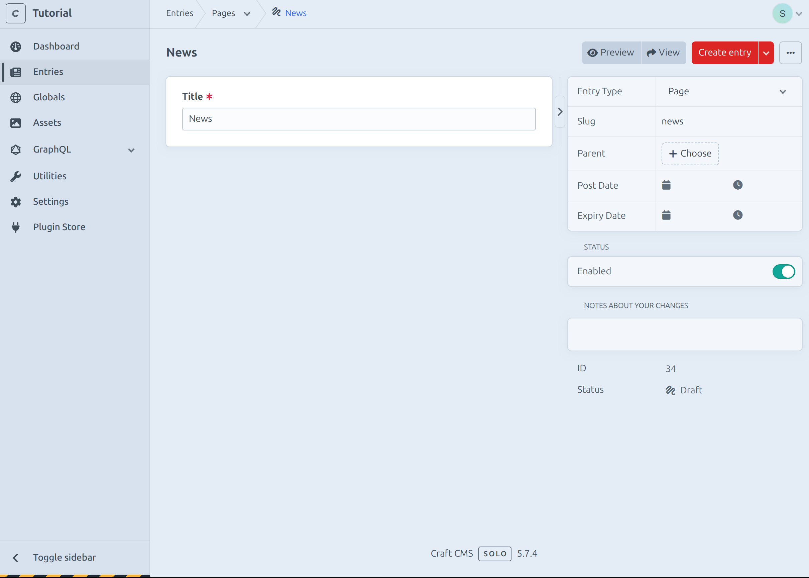

## Header

To allow our users to create a navigation we need to create a new global set.

Go to `Settings` → `Globals` and click on `New global set`.

As a name we will use `Header`. Then click on `New Tab` and confirm.

Now we will create our first field.

Because we want the user to be able to insert multiple navigation items we will use a matrix field.

### Navigation

Click on `Add` and then `New Field`.

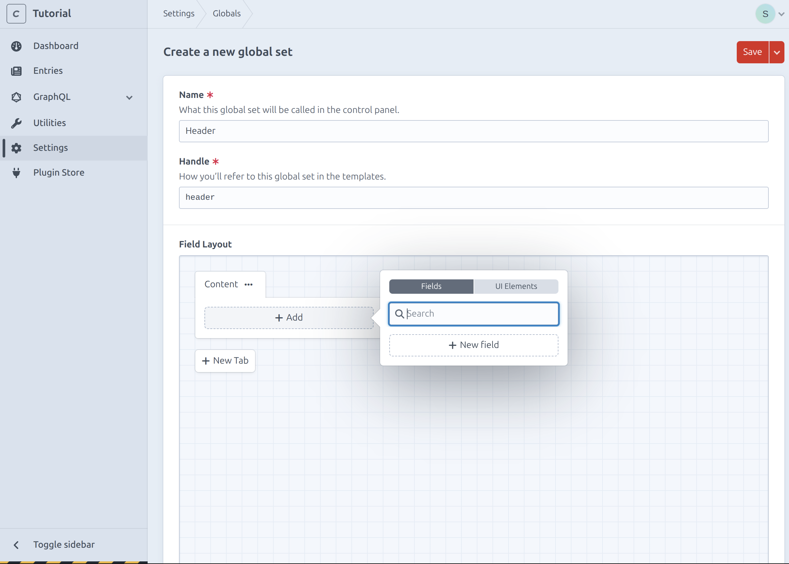

Set the name to `Navigation` and the field type to `Matrix`.
Change the View Mode to `As inline-editable blocks`.

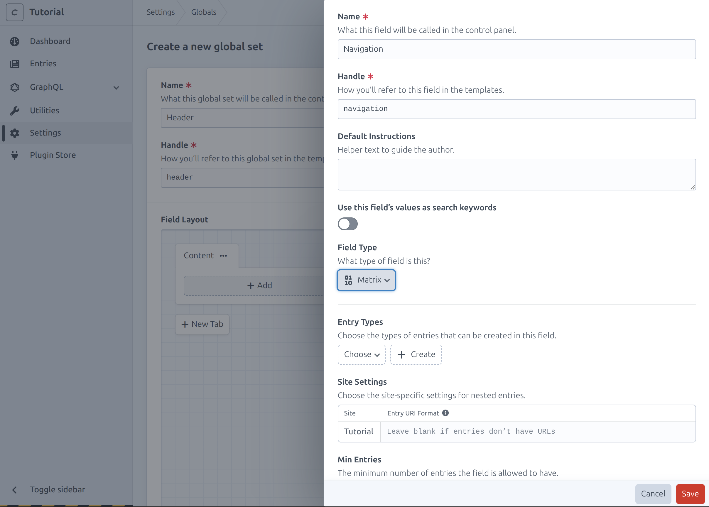

Click `Create` to add a new entry type for the navigation item.
Here you can define all fields which should be repeatable.

Set the name to `Navigation Item`.

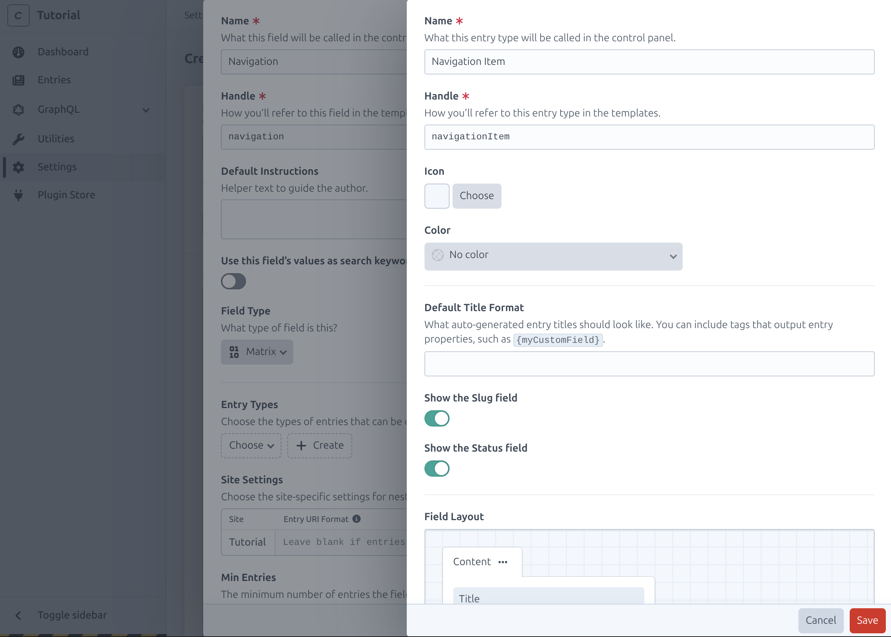

In that entry type you can add a new field called `Nav Link`.
Select the field type `Link`.

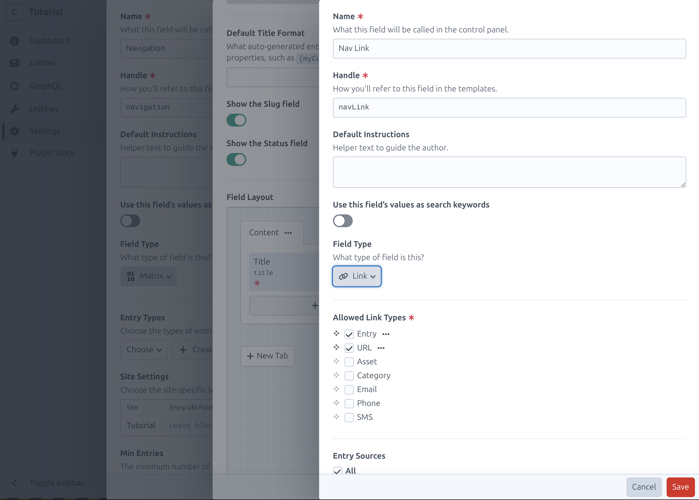

Enable `Show the "Label" field` and `Target`.

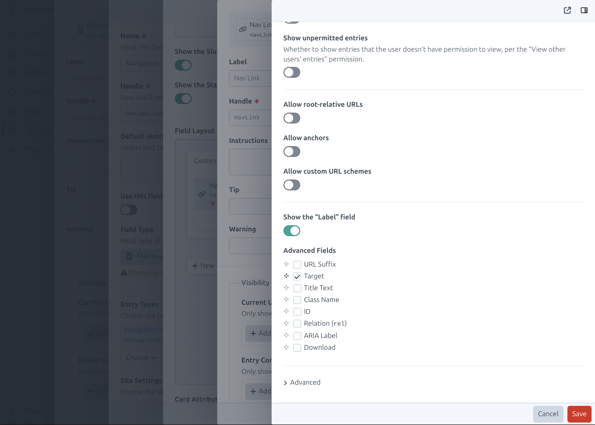

After clicking `Create`, click on the three dots and select `Make required`.
Then remove the `Title` field either by using drag and drop to drop the field into empty space or via or the three dots.

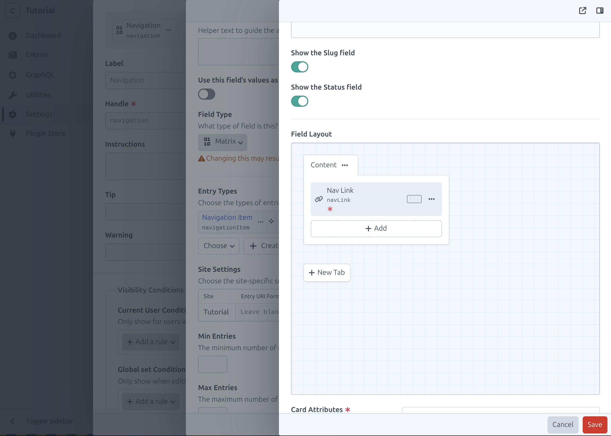

Now save the `navItem`, `navigation` and `header`.

To check what we just did, go to `Globals` in the left hand sidebar of Craft CMS.

Add both pages we created before to the navigation.

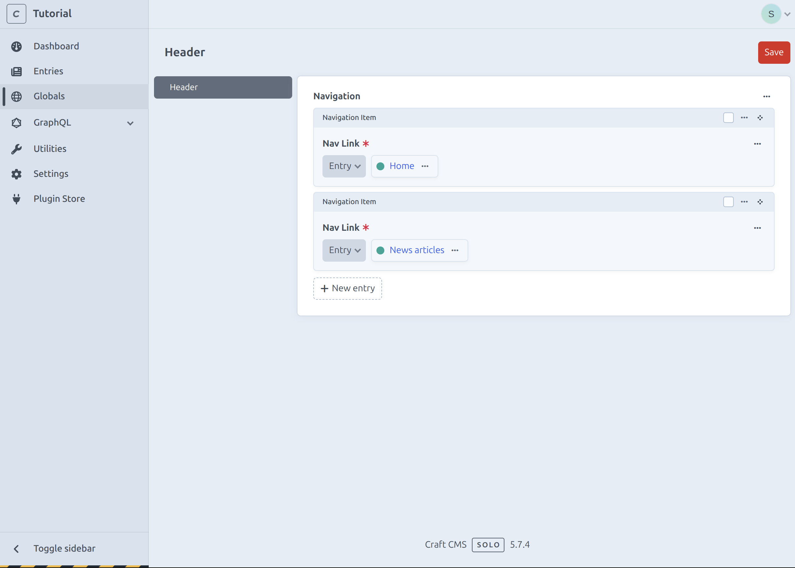

## GraphQl

To finish the part in Craft CMS, we need to allow queries to be made for the newly
created section and global.

Go to `GraphQL` → `Schemas` → `Endpoint Schema`. Select all checkboxes under `Entries` and `Global Sets`.

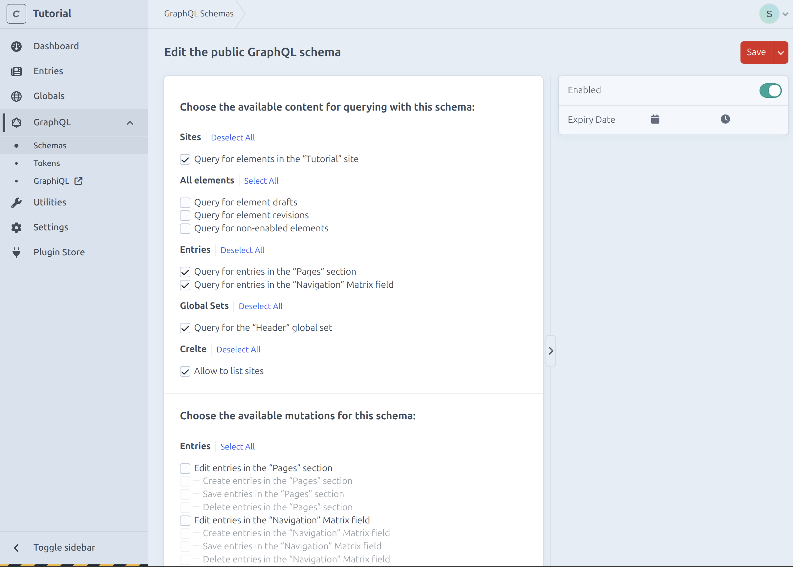
