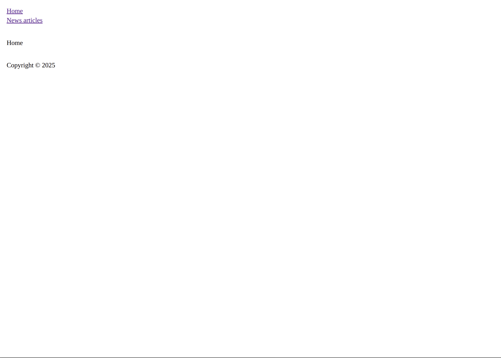

# Svelte Part

To starts lets query the new content we added.

## Header

Modify the `svelte/src/queries/global.graphql` file to the following:
```graphql
query ($siteId: [QueryArgument]) {
  header: globalSet(handle: "header", siteId: $siteId) {
    # specify what fields we want from the header_GlobalSet type
    ... on header_GlobalSet {
      navigation {
        # in the matrix block we want the following fields
        # for the navigationItem_Entry
        ... on navigationItem_Entry {
          # alias the field navLink to link
          link: navLink {
            url
            # this will be the value of the label field if
            # one is defined
            label
            # this will either be the url or the title of the
            # entry
            defaultLabel
            # this will either be null or _blank
            target
          }
        }
      }
    }
  }
}
```

This will add all fields we need to display a header.

Modify the `svelte/src/components/Header.svelte` file to the following:
```svelte
<script>
	import { getGlobal, getRoute } from 'crelte';

	// get the header from the global.graphql file
	// this returns a store which is reactive and changes once the site changes
	const header = getGlobal('header');
	// get the current route
	// this returns a store which is reactive and changes once the route changes
	const route = getRoute();

	export let entry;

	/** @param {import('crelte/routing').Route} route */
	function isActive(route, url) {
		// this makes sure we don't match something like
		// '/abou' when we are on '/about'
		return (route.url + '/').startsWith(url + '/');
	}
</script>

<div class="header">
	<nav>
		<ul>
			<!-- only get nav items which have an url -->
			{#each $header.navigation.filter(i => i.link?.url) as item}
				<li>
					<!-- set the class active if isActive returns true -->
					<a
						href={item.link.url}
						target={item.link.target}
						class:active={isActive($route, item.link.url)}
					>
						<!-- output label and if it is null display the default -->
						{item.link.label ?? item.link.defaultLabel}
					</a>
				</li>
			{/each}
		</ul>
	</nav>
</div>

<style lang="scss">
	.header {
		margin-bottom: 2rem;
	}
</style>
```

## Page

Modify the `svelte/src/queries/entry.graphql` file to the following:
```graphql
query ($uri: [String], $siteId: [QueryArgument]) {
  entry(uri: $uri, siteId: $siteId) {
    id
    siteId
    sectionHandle
    typeHandle
    # those field should be available for home
    ... on home_Entry {
      title
    }
    # those field should be available for a generic page
    ... on page_Entry {
      title
    }
  }
}
```

Now to remove unused files delete `svelte/src/templates/crelte-starter.svelte`.

Let's create a template for the home page, each template file consists of `sectionHandle-typeHandle`
so in the case of the home page this would `pages-home.svelte`.

Create that file with the following content:
```svelte
<script>
	// contains all fields in the entry query for example {id, siteId, title, ...}
	export let entry;
</script>

<h1>{entry.title}</h1>
```

For the moment add the same content to `pages-page.svelte`.

Now if you visit `http://localhost:8080` you should see the title of the home page, and
should be able to navigate to the news page.

