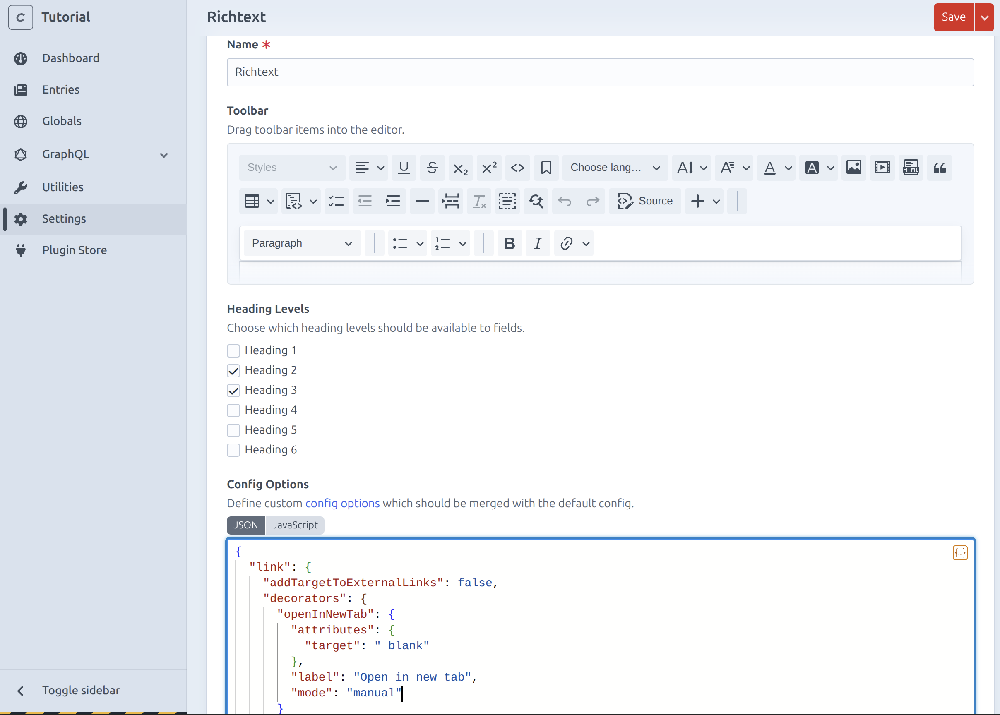
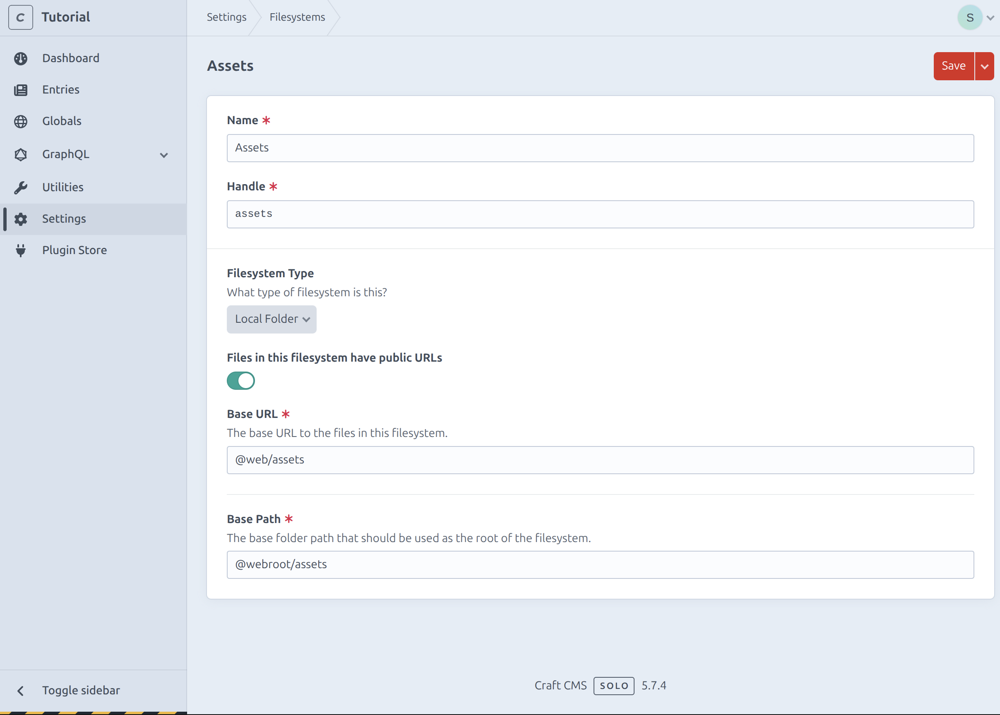
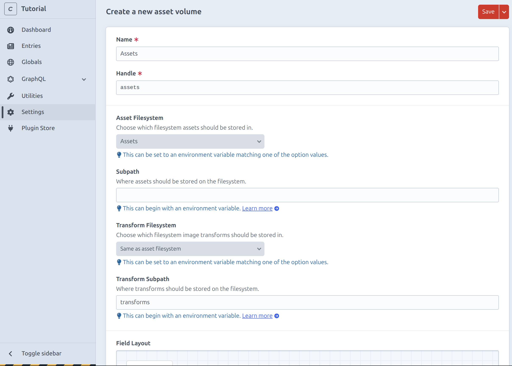
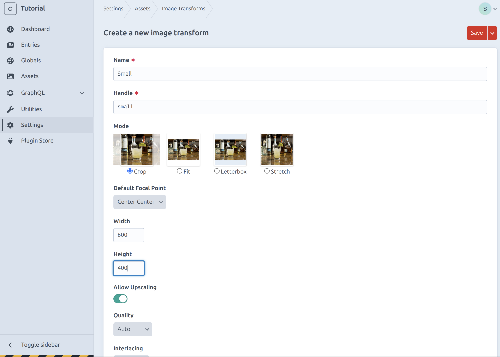
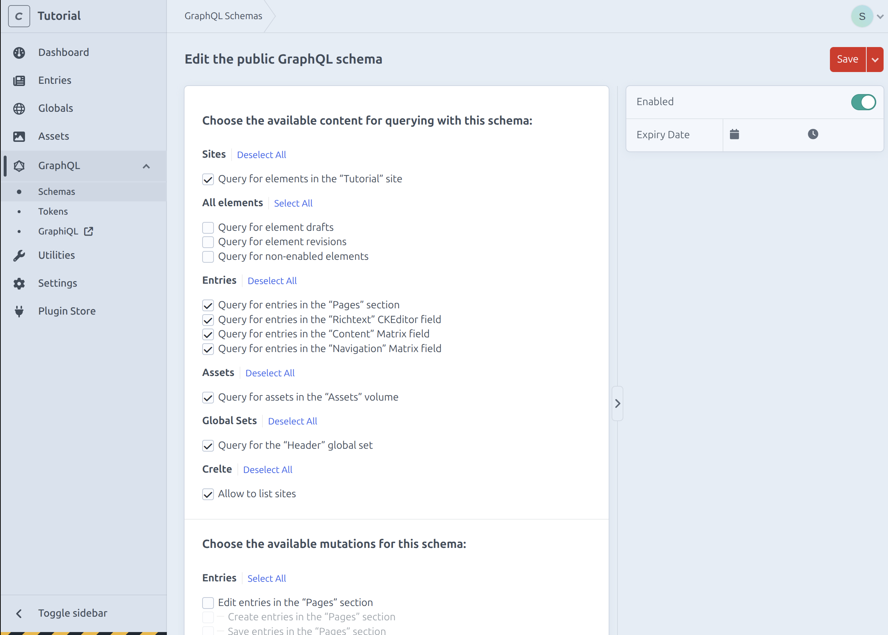
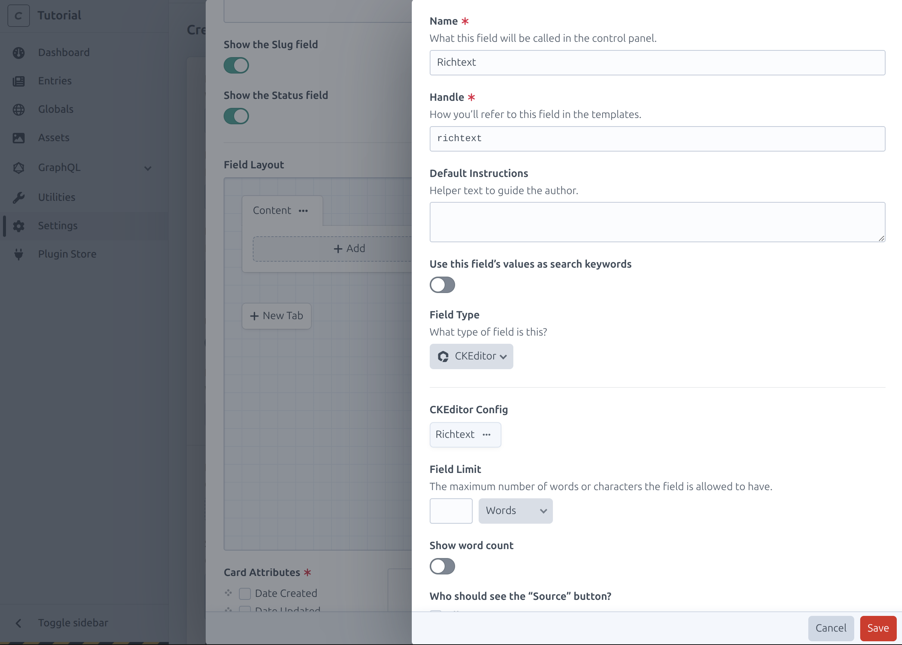
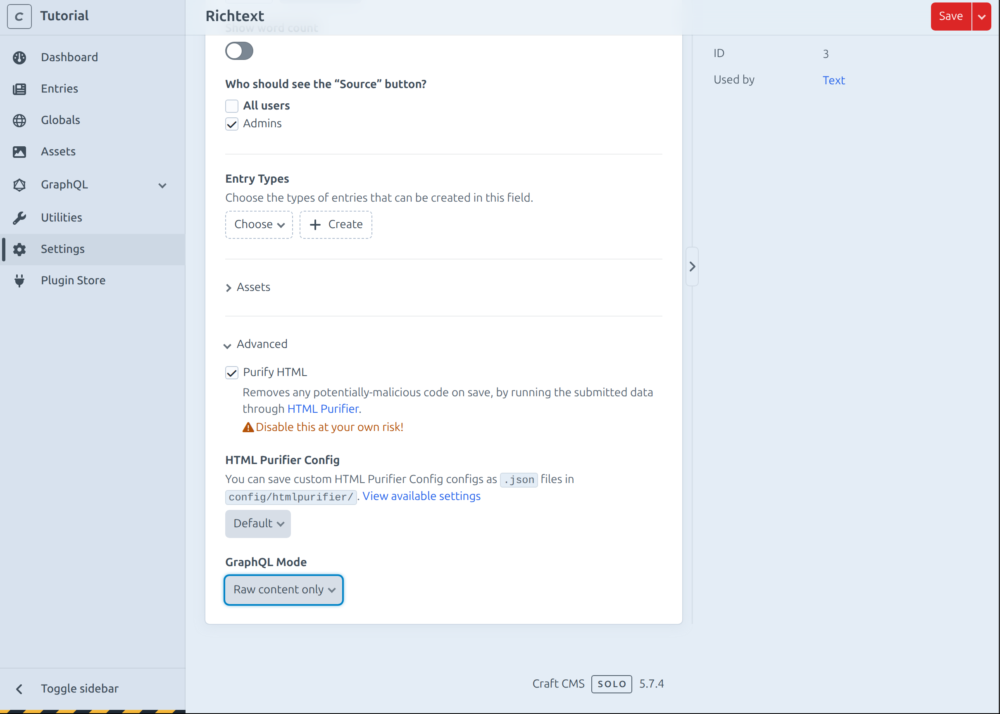
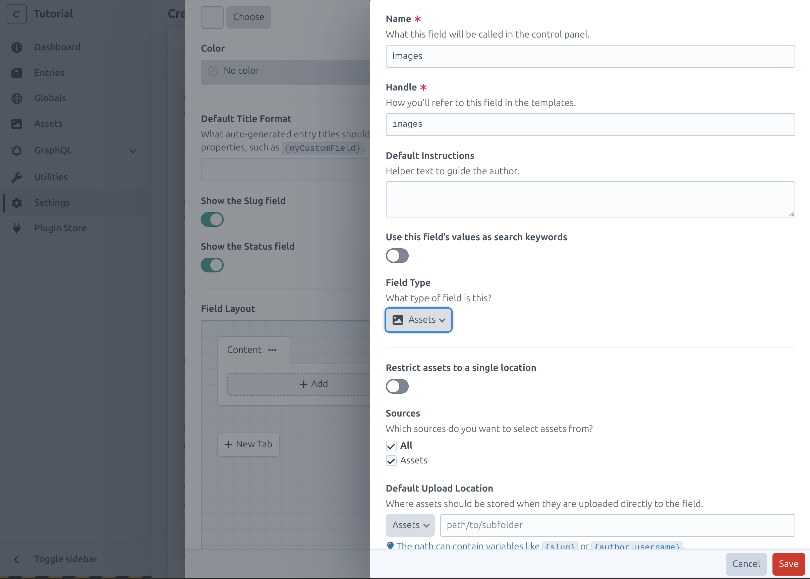
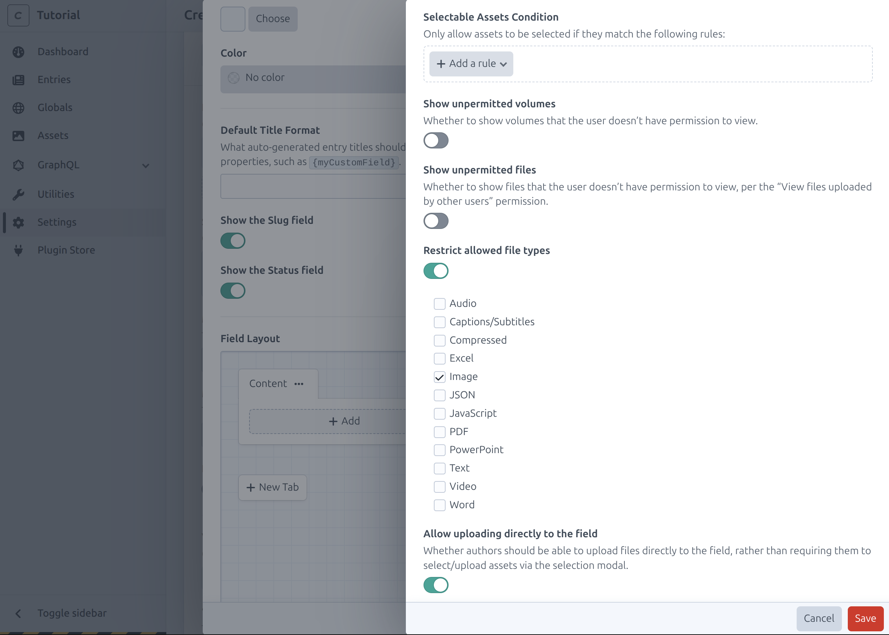

# Craft Content Matrix

For a flexible website a content matrix is a great tools.
This allows the user to extend the content of each page.

Lets create a content matrix with a text and an images block.

## CKE
For the text block we want to use Cke Editor.

Go to `Plugin Store` and search and install `CKEditor 5`.

Go to `Settings > CKEditor` and click `New config`.

Name it `Richtext` and add `Bullet Points` and `Numbered List` to the Taskbar.
Make sure only `Heading 2` and `Heading 3` are selected.
To allow users to select `Open in new tab` add the following config to the `Config Options`.

```json
{
  "link": {
    "addTargetToExternalLinks": false,
    "decorators": {
      "openInNewTab": {
        "attributes": {
          "target": "_blank"
        },
        "label": "Open in new tab",
        "mode": "manual"
      }
    }
  }
}
```

The config should now look something like this:


## Asset Volume

To be able to add asset fields we need to first create a filesystem and volume.

Go to `Settings > Filesystems` and click `New filesystem`.
Name it `Assets` and set the Base URL to `@web/assets` and the Base Path to `@webroot/assets`.


Now go to `Settings > Assets` and click `New volume`.
Name it `Assets` and select the Asset filesystem and set Transform Subpath to `transforms`.


## Transforms

To make sure images aren't too big we will create a few transforms for different device sizes.
Go to `Settings > Assets > Image Transforms` and click `New image transform`.
Name it `Small` and set the Width to `600` and the Height to `400`.


Add another transform named `Medium` and set the Width to `1500` and the Height to `1000`.

## GraphQL

We need to enable the GraphQL API for the asset volume.

Go to `Settings > GraphQL > Endpoint Schema` and select all `Assets`.


## Content Matrix

Lets create the content matrix.
Go to `Settings > Fields` and click `New field`.
Set the name to `Content`, the Field Type to `Matrix` and the View Mode to `As inline-editable blocks`.

## Text
Click `Create` to add a new entry type for the text block.
Name it `Text` remove the Title field and add a new field named `Richtext`.
Set the Field Type to `CKEditor` and select the `Richtext` config we just created.


To make sure we only get HTML go to `Advanced` and set the `GraphQL Mode` to `Raw content only`.


Mark the field as required and save the text entry type.

## Images
Click `Create` to add a new entry type for the image block.
Name it `Images` remove the Title field and add a new field named `Images`.
Set the Field Type to `Assets`.


Restrict the allowed file types to `Image`.


## Assign

After saving the `Content` field go to `Settings > Entry Types` and open `Page`.
Add the `Content` field to the `Content` tab and do the same for the `Home` entry type.
