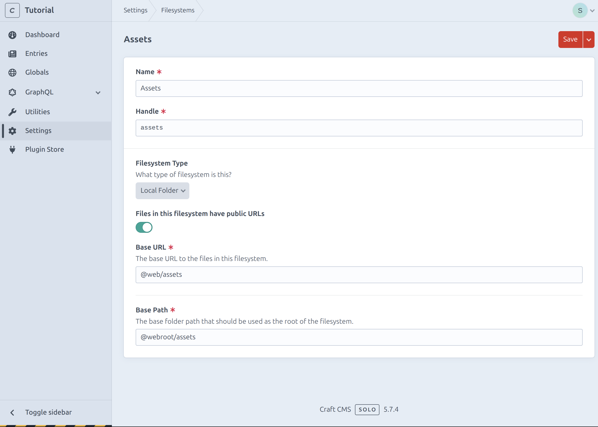
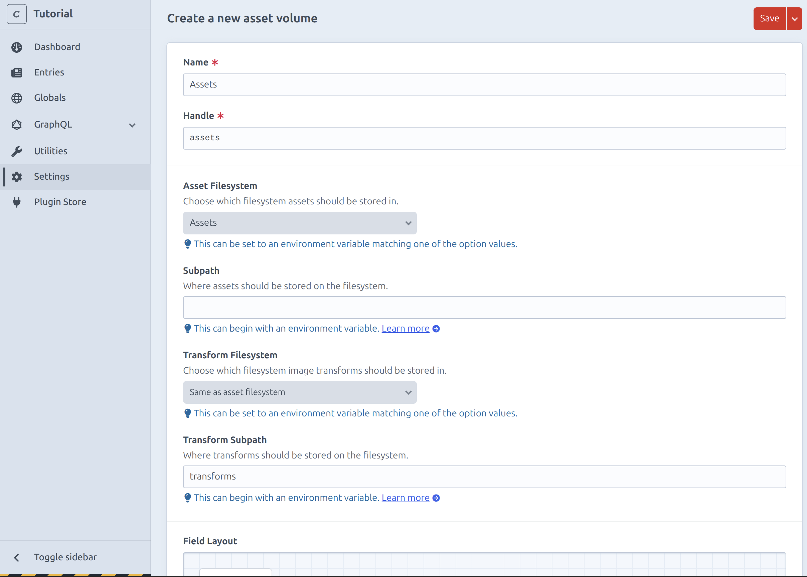
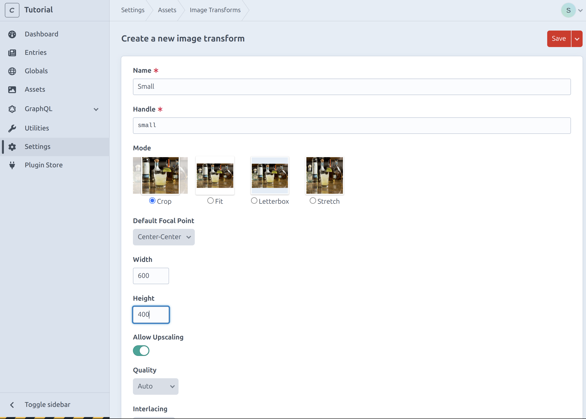
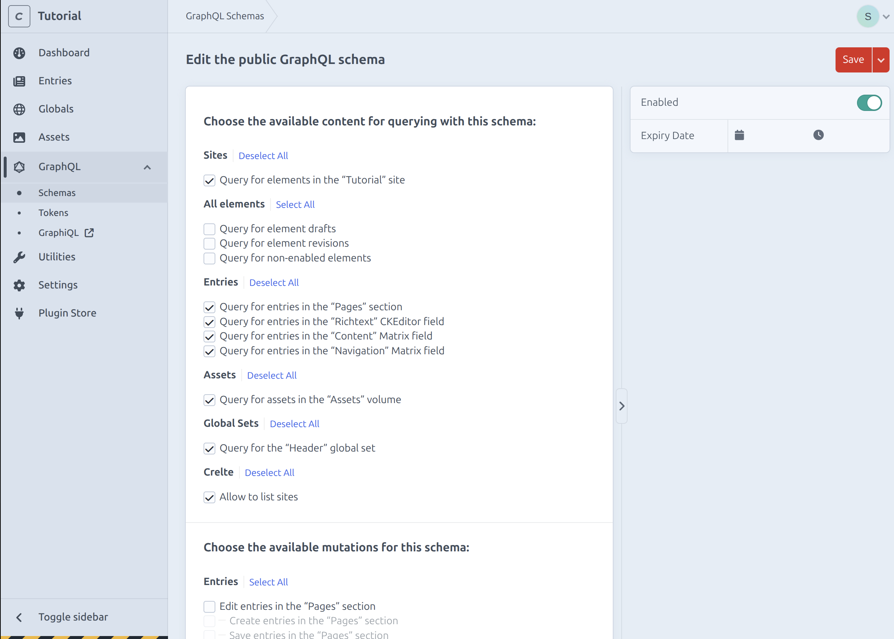
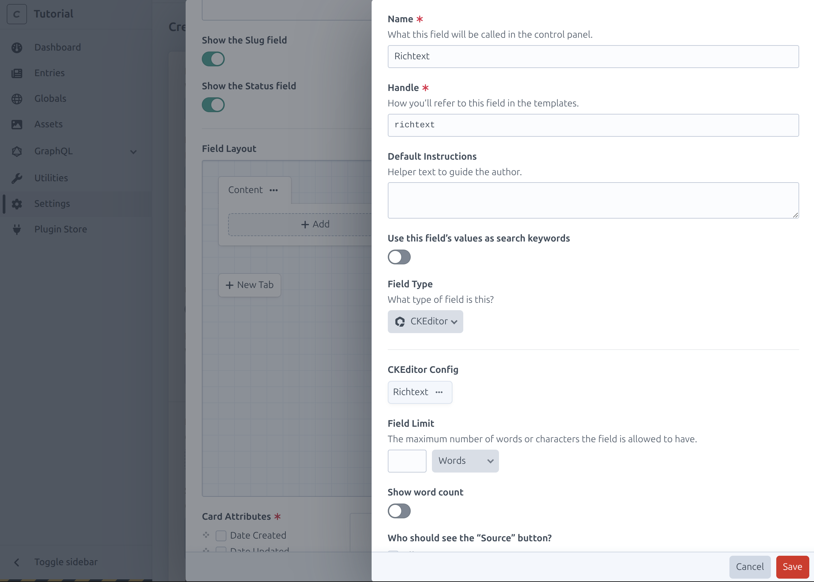
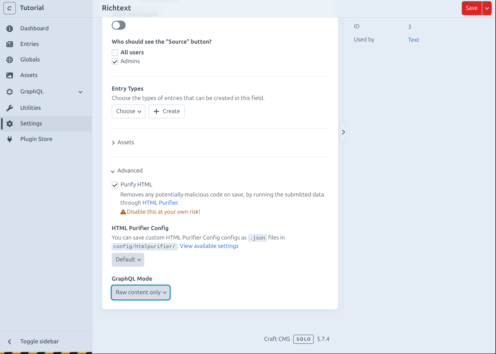
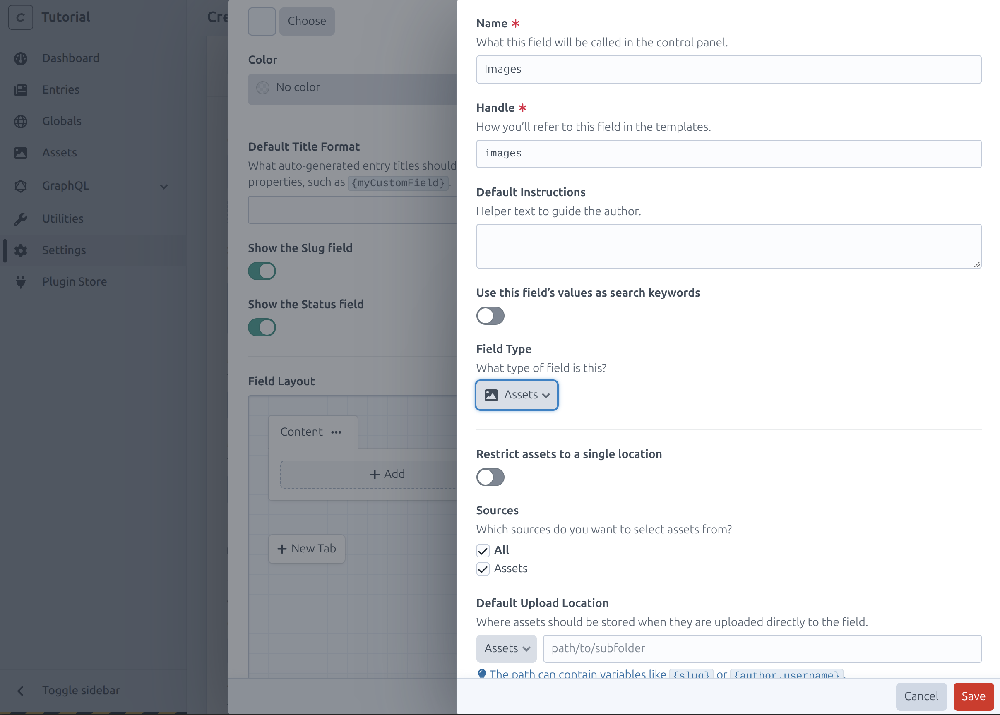
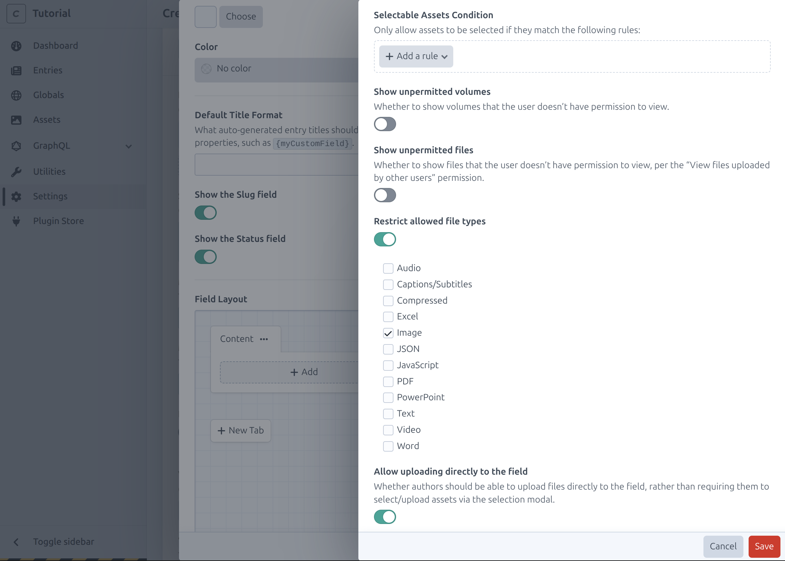

# Craft Content Matrix

Craft's content matrix field is the perfect tool for a modular website with modular content.
It allows user to extend and edit the content of each page using a sandbox-like setup.

Let's create a content matrix with blocks to add text and images.

## CKE

For the text block we want to use CKEditor.

In Craft's sidebar navigation go to `Plugin Store` and search and install [CKEditor 5](https://plugins.craftcms.com/ckeditor).

## Asset Volume

To be able to add asset fields we need to first create a filesystem and volume.

In Craft's sidebar navigation go to `Settings` → `Filesystems` and click `New filesystem`.
Name it `Assets` and set the `Base URL` to `@web/assets` and the `Base Path` to `@webroot/assets`.

In Craft's sidebar navigation go to `Settings` → `Assets` and click `New volume`.
Name it `Assets` and select the `Asset` filesystem and set `Transform Subpath` to `transforms`.

## Transforms

To make sure images aren't too big we will create a few image transforms for different device sizes.
In Craft's sidebar navigation go to `Settings` → `Assets` → `Image Transforms` and click `New image transform`.
Name it `Small` and set the `Width` to `600` and the `Height` to `400`.

Add another transform named `Medium` and set the `Width` to `1500` and the `Height` to `1000`.

## GraphQL

We need to enable the GraphQL API for the asset volume.

In Craft's sidebar navigation go to `Settings` → `GraphQL` → `Endpoint Schema` and select all checkboxes under `Assets`.

## Content Matrix

Lets create the content matrix.
In Craft's sidebar navigation go to `Settings` → `Fields` and click `New field`.
Set the name to `Content`, the field type to `Matrix` and the view mode to `As inline-editable blocks`.

## Text

Click `Create` to add a new entry type for the text block.
Name it `Text`, remove the `Title` field and add a new field named `Richtext`.
Set the field type to `CKEditor` and customize the formatting options according to your needs (e.g. allowing for numbered lists but not for superscript).

To make sure we only get HTML go to `Advanced` and set the `GraphQL Mode` to `Raw content only`.

Mark the field as required and save the entry type.

## Images

Click `Create` to add a new entry type for the image block.
Name it `Images`, remove the `Title` field and add a new field named `Images`.
Set the field type to `Assets`.

Restrict the allowed file types to `Image`.

## Assign

After saving the `Content` field, in Craft's sidebar navigation go to `Settings` → `Entry Types` and open `Page`.
Add the `Content` field to the `Content` tab and do the same for the `Home` entry type.
