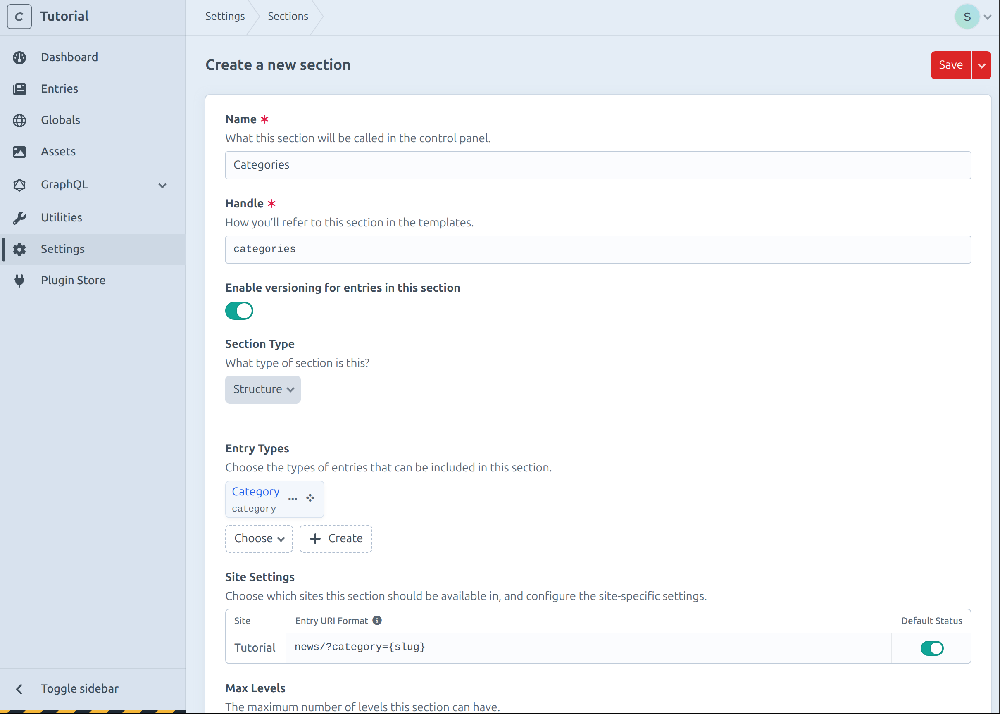
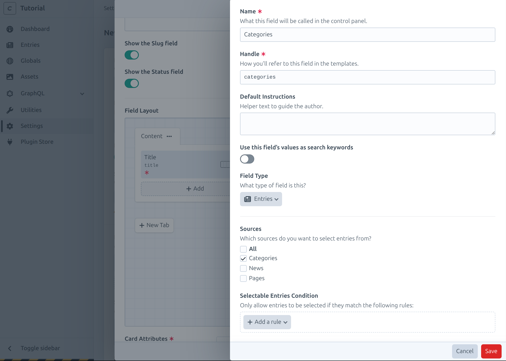
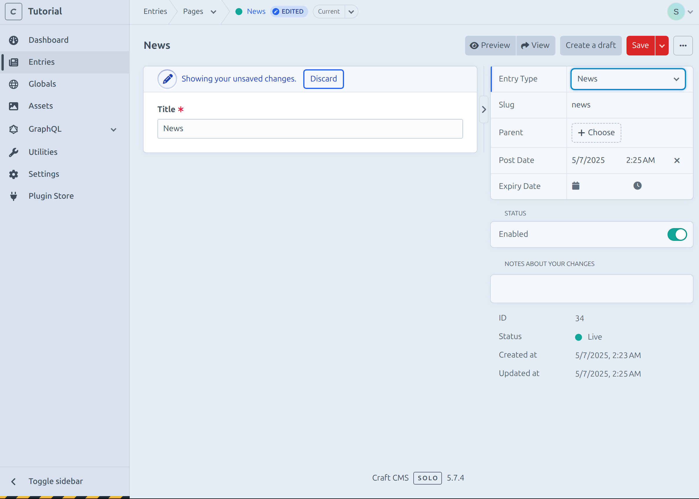

# News Craft

As the last chapter of the tutorial, let's build a news list
with a category filter.

We will start with creating the news and category section.

## Categories

In Craft's sidebar navigation go to `Settings` → `Sections` and click `New section`. Name it `Categories` and set the `Type` to `Structure` which allows users to re-order the categories.

- Change the URI format to `news/?category={id}`.
- Set `Max Levels` to `1` so the categories cannot be nested.
- Create a new entry type named `Category`.

The section should now look like this:

## News

In Craft's sidebar navigation go to `Settings` → `Sections` and click `New section`.

Name it `News` and set the `Type` to `Channel` which lists the articles
in chronological order.

Create a new entry type named `Article`.
Add a new field called `Categories` set the field type to `Entries`.
As source select `Categories`.

Then add the content matrix to the field layout so news articles can contain text and images as well.

## News listing

In Craft's sidebar navigation go to `Settings` → `Sections` and open the `Pages` section.
Create a new entry type called `News`.

## GraphQL

We need to enable the GraphQL API for the news and categories section.

In Craft's sidebar navigation go to `Settings` → `GraphQL` → `Endpoint Schema` and select all checkboxes under `Entries`.

## Content

Before you can start creating a few news articles we need to change the
entry type of the News page to `News`.

Now create a few news articles and categories.
