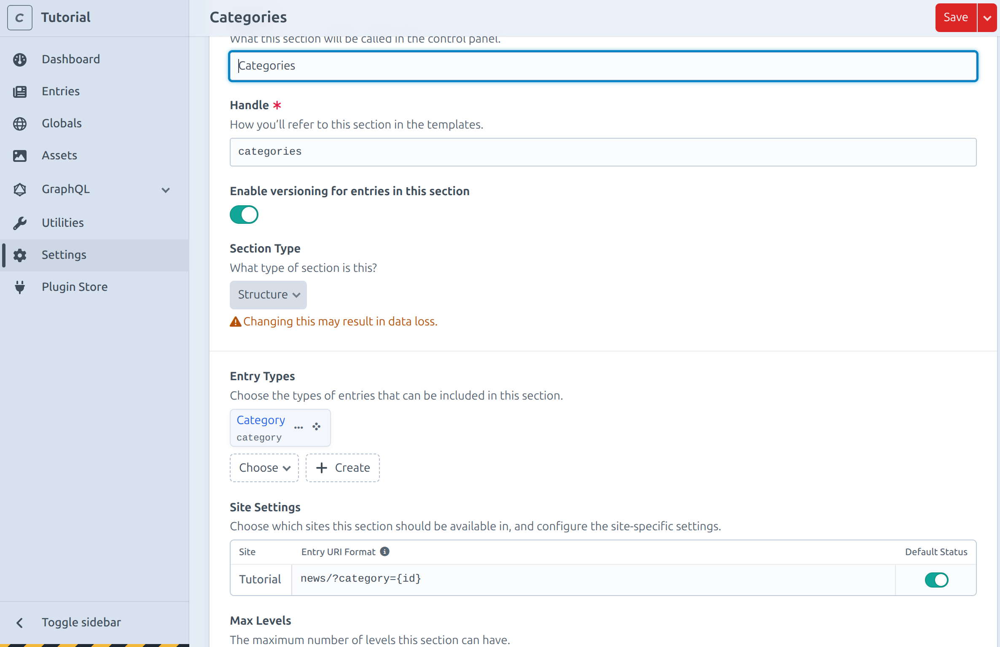

# News Craft

As the last chapter of the tutorial lets build a news list
with a category filter.

We will start with creating the news and category section.

## Categories

Go to `Settings > Sections` and click `New section`.

Name it `Categories` and set the `Type` to `Structure` which allows
to re order the categories.
Change the URI format to `news/?category={id}`.
Set `Max Levels` to `1` so the categories cannot be nested.
Create a new Entry Type named `Category`.

The section should now look like this:

## News

Go to `Settings > Sections` and click `New section`.

Name it `News` and set the `Type` to `Channel` which lists the articles
in chronological order.

Create a new entry type named `Article`.
Add a new field called `Categories` set the Field Type to `Entries`.
As Source select `Categories`.

Then add the content matrix so news articles can contain text and images.

## News listing

Go to `Settings > Sections` and open the `Pages` section.
Create a new Entry type called `News`.

## GraphQL

We need to enable the GraphQL API for the news and categories section.

Go to `Settings > GraphQL > Public Schema` and select all `Entries`.

## Content

Before you can start creating a few news articles we need to change the
entry type of the News page to `News`.

Now create a few news articles and categories.
